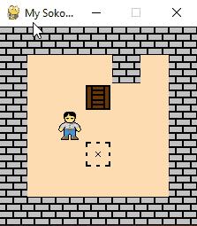

In this project, an automatic agent is developed for an open-source Sokoban implementation [1].  As the chosen open-source implementation was originally compatible with python 2.7. A few changes and fixes were needed to run the implementation in python 3.8. The changes can be seen in the git repository log of the submitted mini-project [2] or on the GitHub page as well.

## Dependencies

pygame can be installed using pip

```pip install pygame```

## Running the project
1. Go into the project directory and run 
```python3 sokoban_agent.py``` 
2. Once the pygame window pops up, the following keyboard keys are available
   1. “a” key for the automatic search algorithm to start and after the solution is found, replay the moves to confirm if the solution is correct.
   2. “u” key to go up manually
   3. “d” key to go down manually
   4. “l” key to go left manually
   5. “r” key to go right manually
   6. “d” key to go undo the last move manually
   7. “q” key to quit the game
The automatic agent should run as seen below as a gif 
   


## References
Based on the Sokoban game implementation at https://github.com/morenod/sokoban 